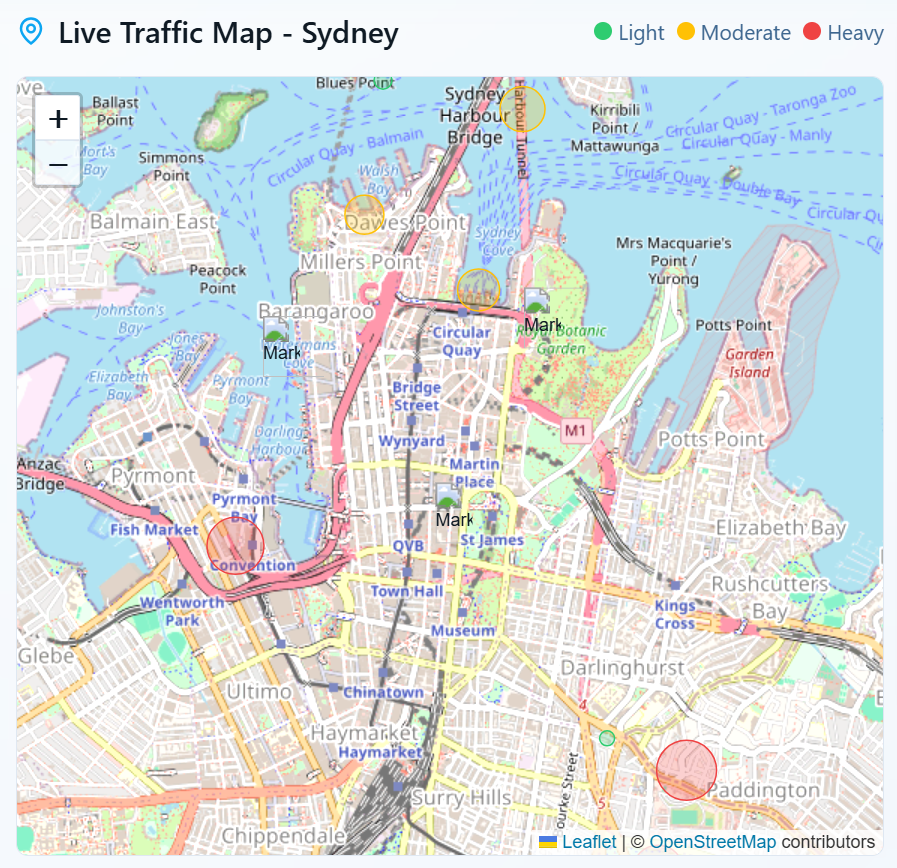

# Edwin Regi Portfolio

A Vite + React portfolio that showcases projects, skills, and a downloadable resume. Built with Tailwind CSS, shadcn/ui, Radix primitives, framer-motion, and React Router.

## Features

- Responsive layout with clean UI components
- Projects grid with individual screenshots and badges
- Resume download from multiple pages
- Smooth entrance animations
- SEO tags per page with `react-helmet`
- Router based navigation
- Easy theming with Tailwind and utility classes

## Tech Stack

- **React 18**, **Vite**
- **Tailwind CSS**, **shadcn/ui**, **Radix UI**
- **framer-motion**
- **react-router-dom**
- **lucide-react** icons

## Screenshots

> Update paths if you change file locations.

| Sydney Traffic Dashboard | Volunteer Database App | Adelaide Fringe Booking |
| --- | --- | --- |
|  |  |  |

## Getting Started

### Prerequisites
- Node 18 or newer
- npm

### Install and run

```bash
npm install
npm run dev
